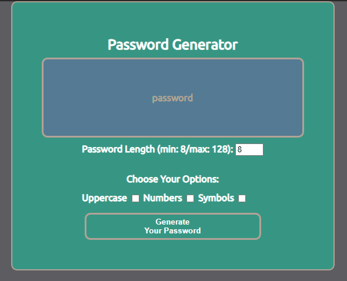

# Password Generator

For 3rd homework involving Javascript. Password Generator that generates between 8 - 128 character password with base lower case letters and options to add upper case, numbers, as well as symbols.

## Acknowledgements

 - General Resource: (https://developer.mozilla.org/en-US/)
 - Free Color Schemes: (https://visme.co/blog/website-color-schemes/)
 - Custom Fonts: (https://fonts.google.com/specimen/Ubuntu)
 - ReadMe Formatter: (https://readme.so/editor)
  
## Demo

  
## Lessons Learned

Learned a lot by watching additional tutorials on how to create a more user friendly password generator. I've taken what I learned from class to understand what the tutorials talk about to fully grasp the concept of what each line of syntax looks to achieve. After receiving multiple comments from grading about lackluster readme, I was lucky enough to stumble across readme.so that is super helpful. I understand now how valuable extra hours spent outside of classroom environment spent investing in my knowledge helps me to comprehend and process the nature of development work is.  
  
## Deployment

https://eccentricality.github.io/003-HW-pwGen/

  